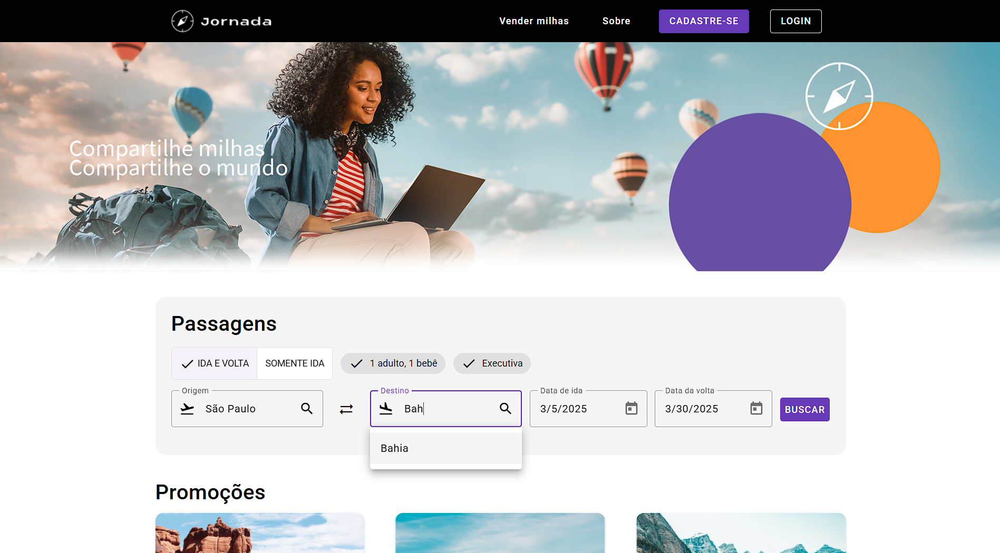

# Projeto de Componentização de Formulários e Integração com API - Angular

Este projeto foi desenvolvido durante o curso da **Alura** sobre **Componentização de Formulários e Integração com API em Angular**. O objetivo principal foi aprender a criar componentes reutilizáveis e controlar o estado de formulários, além de integrar a aplicação com uma API externa para obter dados dinâmicos relacionados a destinos de viagem.



## 🛠️ Funcionalidades

Este projeto implementa um formulário reativo para pesquisa de destinos de viagem, incluindo as seguintes funcionalidades:

- **Componente de Busca**: Criamos um componente controlado por um `FormControl` que centraliza o controle de estado do formulário. O controle é dividido entre o formulário e uma modal.

## 🌍 Integração com a API

A aplicação se comunica com uma API externa para obter dados dinâmicos sobre destinos de viagem. A API retorna informações como:

- **Imagem** do destino
- **Preço** do destino
- **Nome** do destino
- **Origem** e **Destino** para consulta de itinerários


Esses dados são atualizados dinamicamente na aplicação, proporcionando uma experiência mais interativa para os usuários.

Você pode acessar o código da API no seguinte repositório:

[Repositório da API](https://github.com/alura-cursos/jornada-milhas-api.git)

[Figma dessa aplicação você encontra aqui](https://www.figma.com/file/SI696t31Q9zlsXKttCoqKP/Angular%3A-Componentização-e-Design-com-Angular-Material-%7C-Jornada-Milhas?type=design&node-id=4-6408&mode=design&t=mmbAh5QEafSRIGqQ-0).

## ✔️ Tecnologias 

<div align="center">
  
  <br />
</div>

- **Angular**
- **TypeScript**
- **SASS**
- **Angular Material**


## 🚀 Como Rodar o Projeto

Para rodar o projeto em seu ambiente local, siga os passos abaixo:

1. Clone este repositório:
   ```bash
   git clone https://github.com/seu-usuario/projeto-angular.git

2. Navege ao diretório do projeto:
   ```bash
   cd JornadaMilhas

3. Instale as dependências:
   ```bash
   npm install

4. Inicie o servidor:
   ```bash
   ng serve

5. Acesse o projeto no navegador: http://localhost:4200/`
